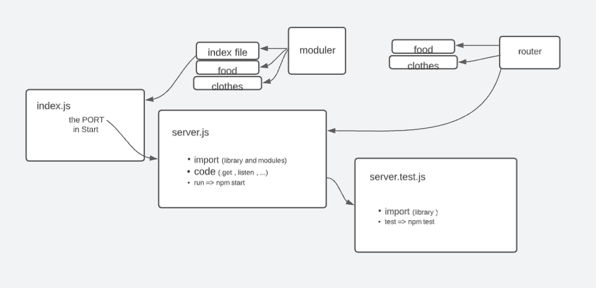

# api-server

# LAB 04: Data Modeling

- Today’s lab adds no new requirements to the API server. Our goal today is to swap out the route handler functions in favor of a Collection Interface which will consume a Sequelize Model and perform generic Database CRUD operations

 

- run the code by using npm start || nodemon
- test the code by using npm test || on the github

 

- start work 1:30 pm ==> finshed at 4:40 pm
